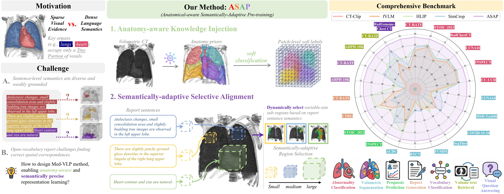

# ASAP

This work presents **ASAP**, a principled vision–language pre-training framework designed for fine-grained medical volumetric representation learning from large-scale chest CT scans and their corresponding radiology reports.

Beyond methodological contributions, we further establish a comprehensive benchmark for medical volumetric vision–language pre-training on chest CT. The benchmark spans 15 datasets and 22 downstream tasks, covering abnormality classification, segmentation, disease prognosis prediction, report generation, vocabulary classification, cross-modal retrieval, and visual question answering.



## Quick Start
- The **pre-trained model** is available at [here](https://drive.google.com/file/d/1_TD1_OV3JGqQYTFE87a42cVC1MJ_AjY-/view?usp=drive_link) (access request may be required).
- The **[Benchmark](./Benchmark/)** provides implementations of 22 downstream tasks, including abnormality classification, segmentation, disease prognosis prediction, report generation, vocabulary classification, cross-modal retrieval, and visual question answering.
- **Datasets**:
    - Download [CT-Rate](https://huggingface.co/datasets/ibrahimhamamci/CT-RATE) dataset.
    - Preprocess raw volumes using [preprocess.py](./preprocess/preprocess.py). Please adjust ``img_root`` and ``save_folder`` accordingly.
    - Download [AKI_Mask](https://huggingface.co/datasets/ToniChopper99/ASAP_AKI) (Anatomy-aware Knowledge Injection mask) aand place it under the CT-Rate directory as follows:
```
├── CT-RATE
    ├── mask_preprocessed
    ├── train_preprocessed
    └── valid_preprocessed
```

## Pre-trained Models
We provide pre-trained model for downstream tasks.
### Load pre-trained models
```python
import numpy as np
import argparse
import torch
import torch.nn as nn
import timm.models.vision_transformer

class PatchEmbed3D(nn.Module):
    """ 
    3D Image to Patch Embedding
    """
    def __init__(self, img_size, patch_size, in_chans=1, embed_dim=768, norm_layer=None, flatten=True, in_chan_last=True):
        super().__init__()
        self.img_size = img_size
        self.patch_size = patch_size
        self.grid_size = (img_size[0] // patch_size[0], img_size[1] // patch_size[1], img_size[2] // patch_size[2])
        self.num_patches = np.prod(self.grid_size)
        self.embed_dim = embed_dim
        self.flatten = flatten
        self.in_chans = in_chans
        self.in_chan_last = in_chan_last
        
        self.proj = nn.Conv3d(in_chans, embed_dim, kernel_size=patch_size, stride=patch_size)
        self.norm = norm_layer(embed_dim) if norm_layer else nn.Identity()


    def forward(self, x):
        B, L, Dim = x.shape
        assert Dim == np.prod(self.patch_size) * self.in_chans, \
            f"Input image total size {Dim} doesn't match model ({self.img_size[0]}*{self.img_size[1]}*{self.img_size[2]})"        
        
        # input image is pathified 3D image
        if self.in_chan_last:
            x = x.reshape(B * L, *self.img_size, self.in_chans).permute(0, 4, 1, 2, 3) # When patchification follows HWDC
        else:
            x = x.reshape(B * L, self.in_chans, *self.img_size)
        
        x = self.proj(x)
        if self.flatten:
            x = x.flatten(2).transpose(1, 2)

        x = x.reshape(B, L, self.embed_dim)
        return x


class VisionTransformer(timm.models.vision_transformer.VisionTransformer):
    """ Vision Transformer with support for global average pooling
    """
    def __init__(self, image_size=(224, 224, 112), patch_size=(16,16,8), in_chans=1, **kwargs):
        super(VisionTransformer, self).__init__(**kwargs)

        self.patch_embed = PatchEmbed3D(img_size=patch_size, patch_size=patch_size, in_chans=in_chans, embed_dim=self.embed_dim)
        self.num_patches = np.prod(image_size) // np.prod(patch_size)
        self.pos_embed = nn.Parameter(torch.zeros(1, self.num_patches+1, self.embed_dim), requires_grad=False)  # fixed sin-cos embedding
    
    def patchify3D(self, imgs):
        """
        imgs: (N, 1, H, W, D)
        x: (N, L,  prod(patch_size) * 1)
        """
        p = self.patch_embed.patch_size
        # assert imgs.shape[2] == imgs.shape[3] and imgs.shape[2] % p[0] == 0

        # h = w = d = imgs.shape[2] // p[0]
        h = imgs.shape[-3] // p[0]
        w = imgs.shape[-2] // p[1]
        d = imgs.shape[-1] // p[2]
        x = imgs.reshape(shape=(imgs.shape[0], 1, h, p[0], w, p[1], d, p[2]))
        x = torch.einsum('nchpwqdr->nhwdpqrc', x)
        x = x.reshape(shape=(imgs.shape[0], h * w * d, p[0] * p[1] * p[2] * 1))
        return x

    def forward_features(self, x):
        B = x.shape[0]
        x = self.patchify3D(x)
        x = self.patch_embed(x)
        cls_tokens = self.cls_token.expand(B, -1, -1)  # stole cls_tokens impl from Phil Wang, thanks
        x = x + self.pos_embed
        x = torch.cat((cls_tokens, x), dim=1)
        x = self.pos_drop(x)
        for blk in self.blocks:
            x = blk(x)
        x = self.norm(x)
        return x
    
    def forward(self, x):
        x = self.forward_features(x)
        return x


def load(model, args):
    pretrained = torch.load(args.pretrained_path, map_location="cpu")
    msg = model.load_state_dict(pretrained["model"], strict=False)
    print(msg)
    return model

parser = argparse.ArgumentParser(description="ASAP models")
parser.add_argument("--roi_x", type=int, default=224, help="roi size in x direction")
parser.add_argument("--roi_y", type=int, default=224, help="roi size in y direction")
parser.add_argument("--roi_z", type=int, default=112, help="roi size in z direction")
parser.add_argument("--patchsize_x", type=int, default=16, help="patch size in x direction")
parser.add_argument("--patchsize_y", type=int, default=16, help="patch size in y direction")
parser.add_argument("--patchsize_z", type=int, default=8, help="patch size in z direction")
parser.add_argument("--pretrained_path", type=str, default="ASAP.pth",
                        help="Where to search for pretrained ViT models.")
args = parser.parse_args()
model = VisionTransformer(
    image_size=(args.roi_x, args.roi_y, args.roi_z), patch_size=(args.patchsize_x, args.patchsize_y, args.patchsize_z),
    in_chans=1, embed_dim=768, depth=12, num_heads=12, mlp_ratio=4, qkv_bias=True)
model = load(model, args)
```

## Pre-training
### Installation
```bash
git clone https://github.com/ToniChopp/ASAP
conda create -n ASAP python==3.11.10
pip install torch==2.4.0 torchvision==0.19.0 torchaudio==2.4.0 --index-url https://download.pytorch.org/whl/cu124 
pip install --no-deps -r requirements.txt
```

We release the full pre-training pipeline of ASAP for reproducibility.
- Download the pre-trained weight of [MAE](https://github.com/facebookresearch/mae) and [CXR-BERT](https://huggingface.co/microsoft/BiomedVLP-CXR-BERT-specialized/tree/main).
- Merge the weights using [merge_checkpoint_asap.py](./Pre-training-ASAP/checkpoints/merge_checkpoint_asap.py).

```bash
cd ./Pre-training-ASAP/checkpoints
python preprocess_checkpoint.py
cd Pre-training-ASAP
bash run.sh
```

## Benchmark
### Download downstream datasets
Please refer to [Acknowledgement](#acknowledgement) section for dataset sources and licensing details.


## Acknowledgement
We emphasize that we are not the original authors of the datasets used in this benchmark. Although all datasets are publicly available for academic research, users are required to **properly cite the corresponding original publications**, as specified in our paper.

For certain datasets (e.g., RadChestCT) that require authorization, access must be obtained directly from the original authors.

We also acknowledge that part of the codebase is adapted from [VOCO](https://github.com/Luffy03/Large-Scale-Medical). Without their contributions, constructing this benchmark would not have been possible.